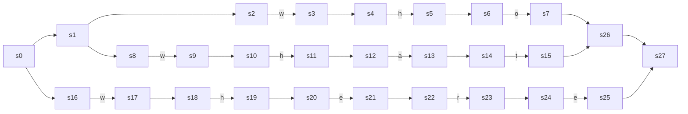
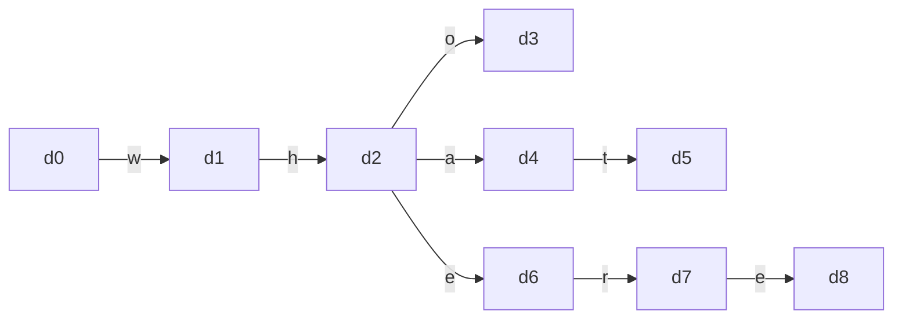
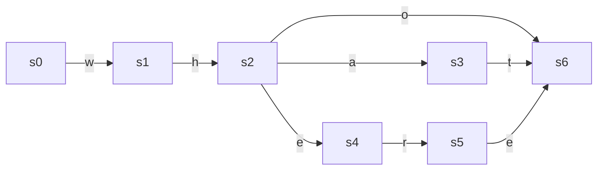
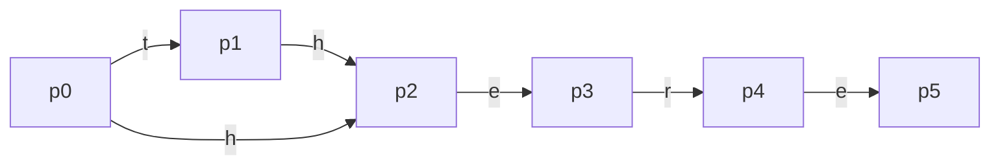
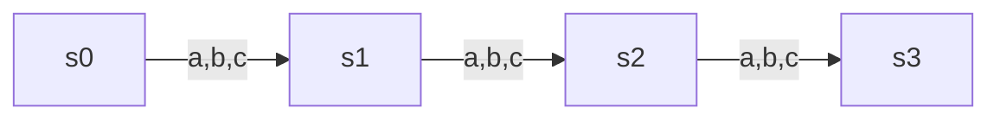
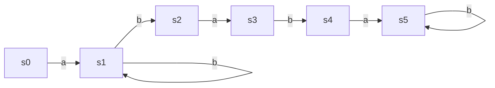
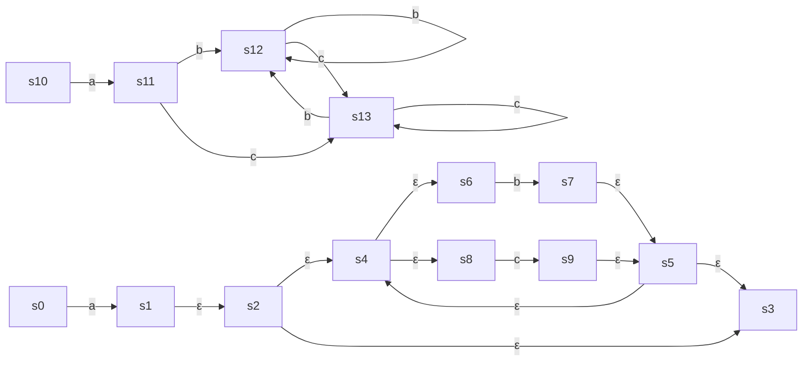
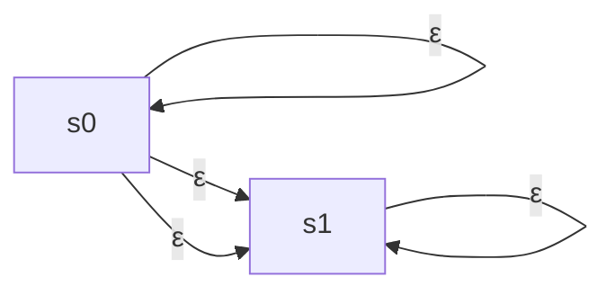

# *Engineering a Compiler, Second Edition* 笔记


## 2 词法分析器

### 2.2 识别单词

概念：

词法（microsyntax）：规定了语言中有效的单词

有限自动机（FA，finite automaton）：单词识别器的形式化方法，FA=(S, E, f, s0, SA)


复习题：

(1) 

```
S={s0, s1, s2, s3, s4, s5, s6}
E={a-zA-Z0-9}
f={
	s0 -- a-zA-Z 		--> s1
	s1 -- a-zA-Z0-9 --> s2
	s2 -- a-zA-Z0-9 --> s3
	s3 -- a-zA-Z0-9 --> s4
	s4 -- a-zA-Z0-9 --> s5
	s5 -- a-zA-Z0-9 --> s6
}
SA={s1, s2, s3, s4, s5, s6}
```

(2)

```
S={s0, s1}
E={()}
f={
	s0 -- () --> s1
	s1 -- () --> s1
}
SA={s1}
```

(3)

```
S={s0, s1, s2}
E={{}a-zA-Z0-9}
f={
	s0 -- { 				--> s1
	s1 -- a-zA-Z0-9 --> s1
	s1 -- } 				--> s2
}
SA={s2}
```

### 2.3 正则表达式

概念：

正则表达式（RE，Regular Expression）：跟有限状态机等效

基本操作：选择、连接、闭包

常见语法：

```
连接
| 或
* 零或多次（叫做闭包 Kleene closure）
+ 一或多次
[0-9] 0|1|2|3|4|5|6|7|8|9
? 零或一次
^ 求补
```

复习题：

(1) 后面接0、1、2、3、4、5个，分别列出来

```
(A|B|C|D|E|F|G|H|I|J|K|L|M|N|O|P|Q|R|S|T|U|V|W|S|Y|Z|a|b|c|d|e|f|g|h|i|j|k|l|m|n|o|p|q|r|s|t|u|v|w|s|y|z)
(

空|

(A|B|C|D|E|F|G|H|I|J|K|L|M|N|O|P|Q|R|S|T|U|V|W|S|Y|Z|a|b|c|d|e|f|g|h|i|j|k|l|m|n|o|p|q|r|s|t|u|v|w|s|y|z|0|1|2|3|4|5|6|7|8|9)|

(A|B|C|D|E|F|G|H|I|J|K|L|M|N|O|P|Q|R|S|T|U|V|W|S|Y|Z|a|b|c|d|e|f|g|h|i|j|k|l|m|n|o|p|q|r|s|t|u|v|w|s|y|z|0|1|2|3|4|5|6|7|8|9)(A|B|C|D|E|F|G|H|I|J|K|L|M|N|O|P|Q|R|S|T|U|V|W|S|Y|Z|a|b|c|d|e|f|g|h|i|j|k|l|m|n|o|p|q|r|s|t|u|v|w|s|y|z|0|1|2|3|4|5|6|7|8|9)|

(A|B|C|D|E|F|G|H|I|J|K|L|M|N|O|P|Q|R|S|T|U|V|W|S|Y|Z|a|b|c|d|e|f|g|h|i|j|k|l|m|n|o|p|q|r|s|t|u|v|w|s|y|z|0|1|2|3|4|5|6|7|8|9)(A|B|C|D|E|F|G|H|I|J|K|L|M|N|O|P|Q|R|S|T|U|V|W|S|Y|Z|a|b|c|d|e|f|g|h|i|j|k|l|m|n|o|p|q|r|s|t|u|v|w|s|y|z|0|1|2|3|4|5|6|7|8|9)(A|B|C|D|E|F|G|H|I|J|K|L|M|N|O|P|Q|R|S|T|U|V|W|S|Y|Z|a|b|c|d|e|f|g|h|i|j|k|l|m|n|o|p|q|r|s|t|u|v|w|s|y|z|0|1|2|3|4|5|6|7|8|9)|

(A|B|C|D|E|F|G|H|I|J|K|L|M|N|O|P|Q|R|S|T|U|V|W|S|Y|Z|a|b|c|d|e|f|g|h|i|j|k|l|m|n|o|p|q|r|s|t|u|v|w|s|y|z|0|1|2|3|4|5|6|7|8|9)(A|B|C|D|E|F|G|H|I|J|K|L|M|N|O|P|Q|R|S|T|U|V|W|S|Y|Z|a|b|c|d|e|f|g|h|i|j|k|l|m|n|o|p|q|r|s|t|u|v|w|s|y|z|0|1|2|3|4|5|6|7|8|9)(A|B|C|D|E|F|G|H|I|J|K|L|M|N|O|P|Q|R|S|T|U|V|W|S|Y|Z|a|b|c|d|e|f|g|h|i|j|k|l|m|n|o|p|q|r|s|t|u|v|w|s|y|z|0|1|2|3|4|5|6|7|8|9)(A|B|C|D|E|F|G|H|I|J|K|L|M|N|O|P|Q|R|S|T|U|V|W|S|Y|Z|a|b|c|d|e|f|g|h|i|j|k|l|m|n|o|p|q|r|s|t|u|v|w|s|y|z|0|1|2|3|4|5|6|7|8|9)|

(A|B|C|D|E|F|G|H|I|J|K|L|M|N|O|P|Q|R|S|T|U|V|W|S|Y|Z|a|b|c|d|e|f|g|h|i|j|k|l|m|n|o|p|q|r|s|t|u|v|w|s|y|z|0|1|2|3|4|5|6|7|8|9)(A|B|C|D|E|F|G|H|I|J|K|L|M|N|O|P|Q|R|S|T|U|V|W|S|Y|Z|a|b|c|d|e|f|g|h|i|j|k|l|m|n|o|p|q|r|s|t|u|v|w|s|y|z|0|1|2|3|4|5|6|7|8|9)(A|B|C|D|E|F|G|H|I|J|K|L|M|N|O|P|Q|R|S|T|U|V|W|S|Y|Z|a|b|c|d|e|f|g|h|i|j|k|l|m|n|o|p|q|r|s|t|u|v|w|s|y|z|0|1|2|3|4|5|6|7|8|9)(A|B|C|D|E|F|G|H|I|J|K|L|M|N|O|P|Q|R|S|T|U|V|W|S|Y|Z|a|b|c|d|e|f|g|h|i|j|k|l|m|n|o|p|q|r|s|t|u|v|w|s|y|z|0|1|2|3|4|5|6|7|8|9)(A|B|C|D|E|F|G|H|I|J|K|L|M|N|O|P|Q|R|S|T|U|V|W|S|Y|Z|a|b|c|d|e|f|g|h|i|j|k|l|m|n|o|p|q|r|s|t|u|v|w|s|y|z|0|1|2|3|4|5|6|7|8|9)

)
```

(2)

```
RE:
"(^"|"")*"

FA:
S={s0, s1}
E={"a-zA-Z,.}
f={
	s0 -- ^" --> s1
	s0 -- "" --> s1
}
SA={s1}
```


### 2.4 从正则表达式到词法分析器

概念：

NFA（Nondeterministic Finite Automaton，非确定性有限自动机）：某些状态对于某些字符有多条转移路线。

DFA（Deterministic Finite Automaton，有限自动机）：唯一转移。

Thompson构造法：从RE构造出NFA，基本转换

Hopcroft最小化DFA

复习题：

(1)

RE: who|what|where

RE -> NFA：Thompson构造法




NFA -> DFA：子集构造法

| 集合名称 | DFA状态 | NFA状态               | w                    | h                     | o          | a       | t           | e       | r       |
| -------- | ------- | --------------------- | -------------------- | --------------------- | ---------- | ------- | ----------- | ------- | ------- |
| q0       | d0      | s0,s1,s2,s8,s16       | s3,s4,s9,s10,s17,s18 |                       |            |         |             |         |         |
| q1       | d1      | s3,s4,s9,s10,s17,s18  |                      | s5,s6,s11,s12,s19,s20 |            |         |             |         |         |
| q2       | d2      | s5,s6,s11,s12,s19,s20 |                      |                       | s7,s26,s27 | s13,s14 |             | s21,s22 |         |
| q3       | d3      | s7,s26,s27            |                      |                       |            |         |             |         |         |
| q4       | d4      | s13,s14               |                      |                       |            |         | s15,s26,s27 |         |         |
| q5       | d5      | s15,s26,s27           |                      |                       |            |         |             |         |         |
| q6       | d6      | s21,s22               |                      |                       |            |         |             |         | s23,s24 |
| q7       | d7      | s23,s24               |                      |                       |            |         |             | s25,s27 |         |
| q8       | d8      | s25,s27               |                      |                       |            |         |             |         |         |





最小化DFA：Hopcroft算法

| 步骤 | 当前划分                                 | 集合                | 字符 | 操作       |
| ---- | ---------------------------------------- | ------------------- | ---- | ---------- |
| 0    | {d3,d5,d8},{d0,d1,d2,d4,d6,d7}           | --                  | --   | --         |
| 1    | {d3,d5,d8},{d0,d1,d2,d4,d6,d7}           | {d3,d5,d8}          | all  | none       |
| 2    | {d3,d5,d8},{d0,d1,d2,d4,d6,d7}           | {d0,d1,d2,d3,d6,d7} | e    | split {d7} |
| 3    | {d3,d5,d8},{d0,d1,d2,d4,d6},{d7}         | {d0,d1,d2,d3,d6}    | r    | split {d6} |
| 4    | {d3,d5,d8},{d0,d1,d2,d4},{d6},{d7}       | {d0,d1,d2,d4}       | t    | split {d4} |
| 5    | {d3,d5,d8},{d0,d1,d2},{d4},{d6},{d7}     | {d0,d1,d2}          | o    | split {d2} |
| 6    | {d3,d5,d8},{d0,d1},{d2},{d4},{d6},{d7}   | {d0,d1}             | h    | split {d1} |
| 7    | {d3,d5,d8},{d0},{d1},{d2},{d4},{d6},{d7} | all                 | all  | none       |





(2)

| 步骤 | 当前划分                                  | 集合                      | 字符 | 操作          |
| ---- | ----------------------------------------- | ------------------------- | ---- | ------------- |
| 0    | {s5,s9},{s0,s1,s2,s3,s4,s6,s7,s8}         | --                        | --   | --            |
| 1    | {s5,s9},{s0,s1,s2,s3,s4,s6,s7,s8}         | {s5,s9}                   | all  | none          |
| 2    | {s5,s9},{s0,s1,s2,s3,s4,s6,s7,s8}         | {s0,s1,s2,s3,s4,s6,s7,s8} | e    | split {s4,s8} |
| 3    | {s5,s9},{s0,s1,s2,s3,s6,s7},{s4,s8}       | {s0,s1,s2,s3,s6,s7}       | r    | split {s3,s7} |
| 4    | {s5,s9},{s0,s1,s2,s6},{s3,s7},{s4,s8}     | {s0,s1,s2,s6}             | e    | split {s2,s6} |
| 5    | {s5,s9},{s0,s1},{s2,s6},{s3,s7},{s4,s8}   | {s0,s1}                   | t    | split {s1}    |
| 6    | {s5,s9},{s0},{s1},{s2,s6},{s3,s7},{s4,s8} | all                       | all  | none          |



### 实现词法分析器

概念：

自动生成词法分析器：表格驱动词法分析器、直接编码的词法分析器

手工编写：手动编码的词法分析器

复习题：

(1)

(a)

| A    | B    | C    |
| ---- | ---- | ---- |
| a    | b    | c    |

(b)

|      | A    | B    | C    |
| ---- | ---- | ---- | ---- |
| s0   | s1   | s2   | s3   |
| s1   |      | s4   |      |
| s2   |      |      | s5   |
| s3   | s6   |      |      |
| s4   |      |      | s7   |
| s5   | s8   |      |      |
| s6   |      | s9   |      |
| s7   | se   | se   | se   |
| s8   | se   | se   | se   |
| s9   | se   | se   | se   |

(c)

```
sinit:
	lexeme = "";
	goto s0;
s0: 
	char = NextChar();
	lexeme = lexeme + char;
	if (char='a') {
		s1();
	} else if (char='b') {
		s2();
	} else if (char='c') {
		s3();
	} else {
		sout();
	}
s1:
	char = NextChar();
	lexeme = lexeme + char;
	if (char='b') {
		s4();
	} else {
		sout();
	}
s2:
	char = NextChar();
	lexeme = lexeme + char;
	if (char='c') {
		s5();
	} else {
		sout();
	}
s3:
	char = NextChar();
	lexeme = lexeme + char;
	if (char='a') {
		s6();
	} else {
		sout();
	}
s4:
	char = NextChar();
	lexeme = lexeme + char;
	if (char='c') {
		s7();
	} else {
		sout();
	}
s5:
	char = NextChar();
	lexeme = lexeme + char;
	if (char='a') {
		s8();
	} else {
		sout();
	}
s6:
	char = NextChar();
	lexeme = lexeme + char;
	if (char='b') {
		s9();
	} else {
		sout();
	}
s7:
	return 'abc';
s8:
	return 'bca';
s9:
	return 'cab';
sout:
	return invalid;
```

(2)

(a)



(b)

```
sinit:
	lexeme = "";
	goto s0;
s0:
	char = NextChar();
	lexeme = lexeme + char;
	if (char='a' || char='b' || char='c') {
		s1();
	} else {
		sout();
	}
s1:
	char = NextChar();
	lexeme = lexeme + char;
	if (char='a' || char='b' || char='c') {
		s2();
	} else {
		sout();
	}
s2:
	char = NextChar();
	lexeme = lexeme + char;
	if (char='a' || char='b' || char='c') {
		if (table[lexeme]) { // 是否在表里面
			return lexeme;
		} else {
			sout();
		}
	} else {
		sout();
	}
sout:
	return invalid;
```

(c)

两个方法的调用长度是一样的，不同点是本方法每次都需要比较三次，并在最后一次中查一次表格。

(3)

没看懂题目。

### 习题

2.2节

(1)

​	(a) 空或者被一个a隔开的一个或多个b的串：`b+|(b+a)+|b+(ab+)+`

​	(b) 开头0或多个10或01，中间00或11，结尾0或多个0或1的串：`(10|01)*(00|11)(0|1)*`

​	(c) `(b|ab)*aaa*ba*b(b|ab)*aa(a|b)*`

(2)

​	(a) `a(a|b)*baba(a|b)*`



​	(b) `(01|1)*111(10|1)*`






